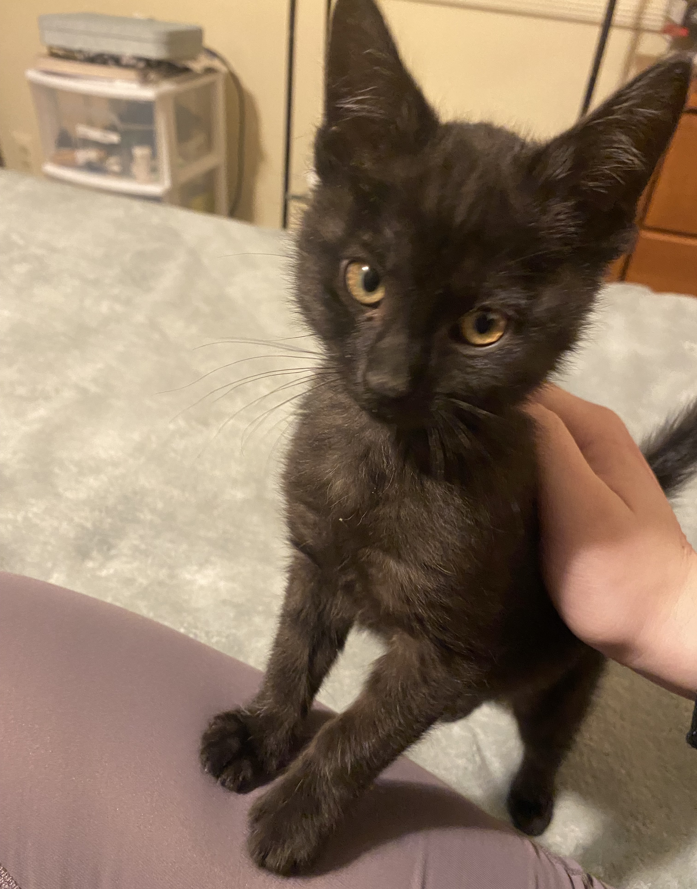
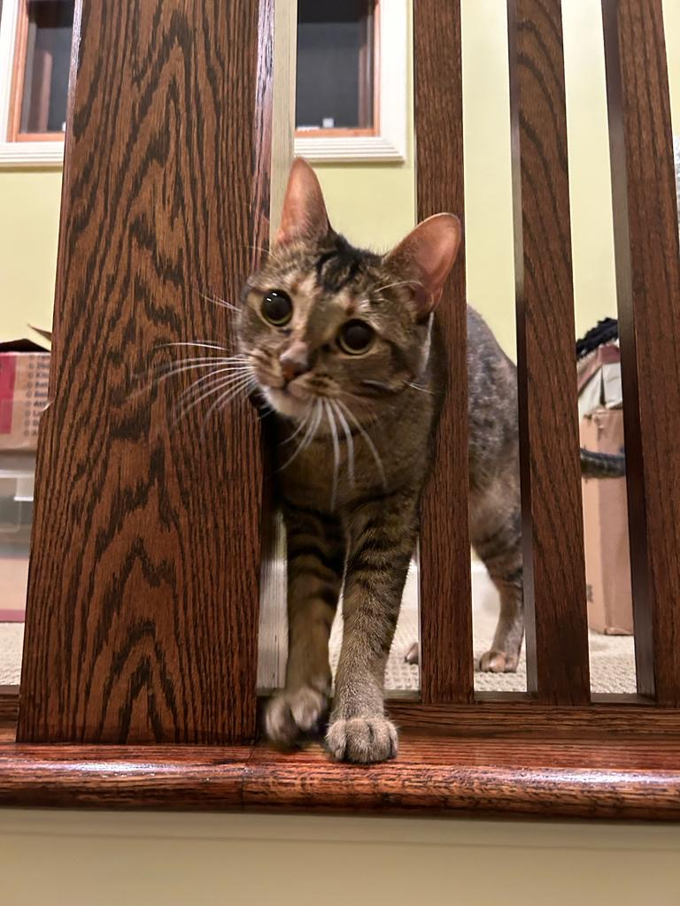

<!DOCTYPE html>
<html>
<head>
  <title>Onyx the Cat</title>
  <link rel="icon" type="image/x-icon" href="favicon.ico">
    <meta charset="utf-8">
    <meta name="viewport" content="width=device-width, initial-scale=1">

</head>
<body>

  <h2>Onyx the Cat</h2>
  

    <nav>
        <ul style="text-align: center;">
            <a href="index.html">Home</a>
            <a href="blogcontinue.html">Posts</a>
        </ul>
    </nav>

  

    

      <h2>Hello! Nice to meet you!</h2>
    

      
    

      
Hi everyone.  My name is Onyx (like the crystal), I'm a black cat, and I was just adopted by a wonderful human as her therapy cat.  At least that is what she told her parents in order to adopt me!  Did you know that Onyx is said to release negative emotions and past trauma, which allows you to heal and move forward? If that is true, I think my name is fits me to a tee. I was born to a feral cat mom, I don’t really know when, but I was pretty little when I was rescued from the mean streets of Michigan. I was the one in the litter that loved to explore everything around me, like socks, food, toys, and boxes. I was originally living with a foster mom who was a part of a foster agency for cats. I had been living with them for about 8 weeks before my life changed for the absolute best.
      

      

      
      
      
      

      
The human who adopted me is named Amelia, and she lives with her parents in a nice house that needs more cat toys. Amelia met me in at a cat yoga event that my foster agency was holding. We just kinda clicked when I crawled up her leg during her downward dog. My foster mom started taking me for weekly visits with Amelia until she eventually let me stay permanently. Amelia has something called aw-tis-m-specter-um disorder. I'm not really sure what that is, but it sounds complicated. Maybe it has something to with her emotional moments and how her brain works. She talks to a woman on her laptop every week about her disorder. But apparently, I help her as well, and I work cheaper and 24/7. Yay for me! 
      

      
Because Amelia is also in college, I have a lot of free time to explore my new house. Every day I wake up the nearest human in the house to get me some food. Then I spend the rest of the day napping, grooming myself, and napping again. When my human is at home, I'm typically cuddling her or biting her fingers (don’t worry, she’s ok with it!). But enough about my interests, let's get into how I got here.  In addition to sleeping and eating a girl has to have a few hobbies.  Mine include messing with my 4-legged siblings, turning anything smaller than me into a toy and chasing it around the house, eating my food and everyone else’s, drinking from great big bowls that the humans sit on, and, recently, blogging. I decided to start blogging after I stumbled on Amelia’s laptop while she was asleep. By stumbled on I mean I walked on it, and suddenly there were noises, lights, and words.  It was almost magic! I think my human may be correct – I may be the smartest cat ever!  Alas, a blog was born!
      

      

      
      
      

      
In this blog post I want to introduce you to the other house inhabitants. As I said, I have both 2 and 4-legged siblings. When I arrived it was like a zoo!   My big sister Bobbi, who's also a cat, was not that happy about my arrival.  She really only wants to cuddle with Amelia’s mom and she really does not like to play with me.   On the other hand, she rarely gets upset when I eat her food.  She never drinks out of the big bowl, which is crazy, but other than that I can live with her. The craziest part of being adopted by Amelia is the crazy doggy big sisters, Penni and Lucy. Penni is a bit older but still has some kick in her and sometimes decides to chase me around the house. Lucy on the other hand is a bit shy with visitors but loves to play when only the family is home. I think she thinks she is the boss, but I know the truth. I am the feline in charge. Of course Amelia is  my favorite housemate. She is always giving me treats, cuddling me, letting me chomp her fingers, and playing with me.
      

      
If I have a complaint, or two, I think that is okay.  First, I just wish the humans didn't have to leave in the morning and not come back until the afternoon or even later. Sometimes the food bowl is empty for literally hours!  Amelia goes to something called "college" and Marcy goes to a placed called work.  What is work?  Am I not enough work? I can do better at creating messes if they need me to.
      

      
Amelia also has two older human sisters, whom I haven't met yet but hear a lot about, mostly in sentences with "med school" and "France". What is France and will I like it?  One of them has cat too, who they say is my cousin, whatever that is. I can't wait to meet them. They just need to remember in this house and I am the new boss.
      

      
I have to go now but I will try to post every week. My aim is for my blog to bring some joy into your surely difficult human lives. Seriously, if I know anything from watching Amelia and other humans, it's that humans spend half the day being happy and the other half being miserable and/or angry. What's got everyone so worked up? The weather? Politics?  Or maybe cleaning another litter box?  Boy, am I glad to be a cat. Bye for now!
      

      
- Onyx
      

    

  

  

    

      <h2>About Me</h2>
      

        
      

      
I'm a black cat who secretly blogs. Don't tell my human!

    

    

      <h3>Popular Posts</h3>
      

        
      

    

    

      <h3>Follow Me</h3>
      <li><a href="#">Instagram</a></li>
    

    
    
    
    

  

  <a href="blogcontinue.html" class="p4">Wanna see my all posts? Click here!</a>

</body>
</html>
